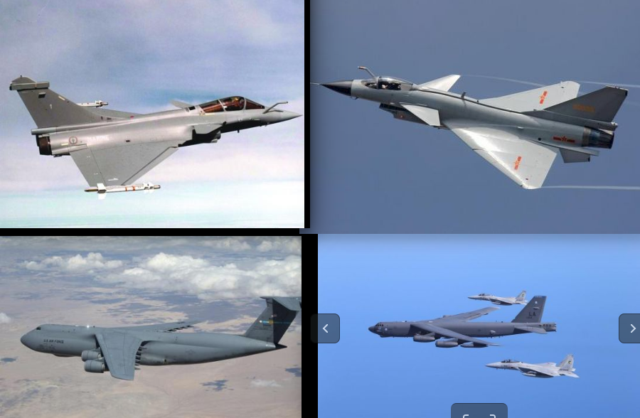

## Aeroplane_Imgs 

A mini image dataset of fighter aeroplanes used to recognition and classification tasks, 
especially suite for fine grained classification and interpretable learning, which contains 20 classes 
and 40 imgaes per class.

Because some of the samples are extremely similar like below

it's quite valuable to measure the discriminative of a classifier and the semantic representations, the baseline using inception-v3 without other tricks is 68.4% accuracy.

## Note
Images are publicly available on Internet, copyright issues please contact [codestorm04@163.com](codestorm04@163.com).
